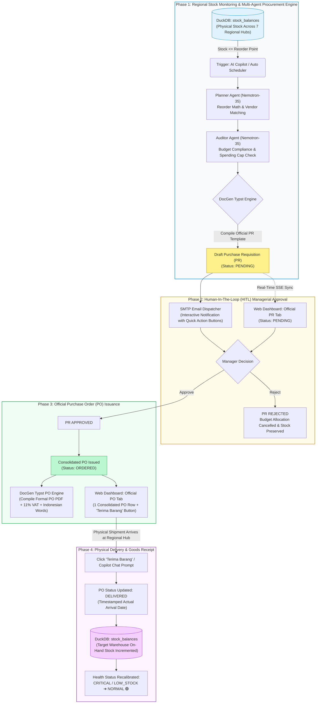

<div align="center">
  <h1>🏢 PT BALI TOWERINDO SENTRA TBK</h1>
  <h3>📦 AutoRestock-Agent — Autonomous Multi-Agent Procurement & Operational Intelligence</h3>
  <p>
    
    
    
    
    
    
  </p>
</div>

---

## 📝 Overview

**AutoRestock-Agent** is an enterprise-grade autonomous multi-agent procurement and operational intelligence platform built with **FastAPI**, **LangGraph**, **DuckDB**, and **Typst Engine**. It is specifically engineered to automate and govern the procurement lifecycle for telecommunications tower infrastructure and fiber-optic network materials at PT Bali Towerindo Sentra Tbk in an autonomous, auditable, and end-to-end manner.

The system continuously monitors inventory balances across 7 regional logistics hubs in real time, detects critical materials falling below their *Reorder Point (ROP)*, computes optimal restock volumes (*Economic Order Quantity / Safety Stock*), matches verified vendor partners, compiles formal corporate **Purchase Requisition (PR)** and **Purchase Order (PO)** documents, dispatches interactive approval notifications to managers via SMTP email, and synchronizes physical **Goods Receipt** directly into regional warehouse balances.

---

## 🔄 End-to-End System Architecture & Workflow

The following flowchart illustrates the complete procurement and operational lifecycle across all multi-agent phases:



---

## ⚙️ Detailed 4-Phase Procurement Lifecycle

### 1. Phase 1: Regional Stock Monitoring & Multi-Agent Procurement Engine
- **Warehouse Data Granularity**: The system tracks physical stock balances across 7 regional logistics hubs (`WH-JKT-01`, `WH-BDG-01`, `WH-SBY-01`, `WH-SMG-01`, `WH-MDN-01`, `WH-MKS-01`, `WH-DPS-01`).
- **Early Warning Detection**: When `quantity_on_hand <= reorder_point`, automated triggers or user chat commands via the AI Copilot initiate the restock process.
- **SKU Demand Aggregation**: If multiple regional warehouses require the same material simultaneously, the system aggregates reorder quantities per unique material SKU into a single PR line item, avoiding redundant supplier inquiries.
- **Auditor & Typst DocGen**: Multi-agent nodes verify budgetary compliance against spending thresholds and compile an official, corporate-letterhead PR document in vector PDF format with status **`PENDING`**.

### 2. Phase 2: Human-In-The-Loop (HITL) Managerial Approval
- **Lifecycle Decoupling**: While a PR is in `PENDING` status, no Purchase Order (**PO**) is published to vendors, and no premature goods receipt button appears.
- **Interactive Email Notifications**: An automated email is dispatched to the procurement manager via SMTP, complete with material summaries, the attached PR PDF, and embedded one-click *Approve* or *Reject* authorization buttons.
- **Web Dashboard Synchronization**: The web dashboard real-time table displays the requisition under *Dokumen Purchase Requisition Resmi* with a yellow **`PENDING`** badge.

### 3. Phase 3: Consolidated Purchase Order (PO) Issuance
- **Approval Trigger**: The manager approves the requisition (via email or direct dashboard interaction).
- **1 Consolidated PO per PR**: All items under the approved PR are consolidated under a **single official PO number** (e.g., `PO-2026-038` / `PO/BLT/2026/03/036`) with status **`ORDERED`**.
- **Intelligent Regional Warehouse Targeting**: Each item's delivery destination is resolved dynamically to the regional logistics hub that originally triggered the critical stock alert (e.g., FO cables are routed to Bandung Hub `WH-BDG-01`).
- **Official Typst PO Compilation**: The PO document is compiled to PDF format with 11% Indonesian VAT (*PPN*), itemized subtotal calculations, spelled-out grammatical currency (*terbilang*), and formal terms and conditions of PT Bali Towerindo Sentra Tbk.

### 4. Phase 4: Single-Click Physical Goods Receipt (*Terima Barang*)
- **Arrival Verification**: When the physical shipment arrives at the destination regional hub, warehouse personnel click **1 button `[✓ Terima Barang]`** on the dashboard row, or issue a prompt to the AI Copilot: *"Barang untuk PO-2026-038 sudah sampai di gudang"*.
- **Multi-Item Simultaneous Receipt**: All materials under that PO are processed in a single transaction:
  1. PO status updates to **`DELIVERED`** with the actual delivery date recorded.
  2. Physical quantities on the `stock_balances` table for the respective regional warehouses are incremented (`quantity_on_hand += order_quantity`).
  3. Stock health status recalibrates and recovers to **`NORMAL`** 🟢.
  4. Idempotent guards prevent accidental double-increments to maintain absolute inventory integrity.

---

## 🏛️ Multi-Tenant Architecture & Corporate Business Domains

The platform implements strict Role-Based Access Control (RBAC) and tenant isolation across corporate divisions:

| Schema / Persona | Corporate Division | Responsibilities & Core Features |
| :--- | :--- | :--- |
| **Schema A** (`usera`) | **Logistics & Inventory** | Monitoring 7 regional hub balances, calculating restock quantities, PR approval, single-click Goods Receipt, and new material SKU registration. |
| **Schema B** (`userb`) | **Human Resources & GA** | Field technician/rigger leave submissions, pending leave audit workflow (`WF-847DA5`), HR email authorization, and automated annual leave quota deduction. |
| **Schema C** (`userc`) | **Finance & Commercial** | Telecom operator client onboarding (Telkomsel, Indosat Ooredoo Hutchison, XL Axiata, Smartfren), Master Lease Agreement (MLA) contract drafting, and billing invoice generation. |
| **Super Admin** (`admin`) | **Enterprise Admin** | Cross-tenant administrative access, dynamic Natural Language Custom Workflow Orchestration, DuckDB master database management, and system audit logging. |

---

## 💻 Tech Stack

| Component | Technology | Description |
| :--- | :--- | :--- |
| **Core Backend** | Python 3.10+, FastAPI, Pydantic v2 | Asynchronous high-performance RESTful API service |
| **AI Multi-Agent** | LangGraph, NVIDIA Nemotron-35, Ollama / Gemini | Autonomous agent coordination, math planner, and budget auditor |
| **Analytical Database** | DuckDB Embedded | High-speed in-process OLAP engine with dual CSV persistence |
| **Document Engine** | Typst Compiler (Python Typst 0.11+) | Ultra-fast vector PDF typesetting with corporate typography |
| **Notification Engine**| Python smtplib / aiosmtplib | Corporate HTML email dispatch with interactive action buttons |
| **Frontend Dashboard** | Semantic HTML5, Vanilla CSS, JavaScript, SSE | Responsive modern dark/light corporate interface with zero external CSS bloat |

---

## 🚀 Getting Started & Operational Guide

### 1. Prerequisites
- Python 3.10 or higher
- Git
- Local machine or Linux server (Ubuntu/Debian)

### 2. Dependency Installation
```bash
# Clone the repository
git clone https://github.com/daffaarigoh/AutoRestock-Agent.git
cd AutoRestock-Agent

# Create and activate virtual environment
python -m venv .venv
# On Linux/macOS:
source .venv/bin/activate
# On Windows:
.venv\Scripts\activate

# Install required packages
pip install -r requirements.txt
```

### 3. Database Initialization & Seeding
```bash
# Initialize DuckDB master tables and seed Bali Tower logistics data
python database/seed_data.py
```

### 4. Running Backend Server & Dashboard
```bash
# Launch FastAPI application on port 8050
python -m uvicorn api.main:app --host 0.0.0.0 --port 8050 --reload
```

- **Web Dashboard UI**: [http://localhost:8050](http://localhost:8050)
- **Interactive Swagger Docs**: [http://localhost:8050/docs](http://localhost:8050/docs)
- **Default Corporate Credentials**:
  - `admin` / `admin123` (Super Admin)
  - `usera` / `user123` (Inventory & Logistics Division)
  - `userb` / `user123` (Human Resources & GA Division)
  - `userc` / `user123` (Finance & Commercial Division)

---

## 🧪 Automated Testing & Verification

Run the automated test suite to validate the multi-agent procurement pipeline and document generation:

```bash
# Run all unit and integration tests
python -m unittest discover -s tests -p "test_*.py"

# Test Typst PDF Purchase Order compilation
python tests/test_po_pdf_generation.py

# Test end-to-end procurement API pipeline
python tests/test_api_and_pipeline.py
```

---

## 📂 Repository Structure

```text
AutoRestock-Agent/
├── agents/                  # LangGraph multi-agent logic (Planner, Auditor, Router, JSON Executor)
├── api/                     # FastAPI endpoint routers (Balitower, Approvals, Agents, Auth, Documents)
├── core/                    # System configurations, env loader, Pydantic schemas, JWT security
├── data/                    # Persistent Bali Tower CSV datasets (Inventory, HR, Finance)
├── database/                # DuckDB initialization, master schemas, migration & seeding scripts
├── docgen/                  # Typst compilation engine & official templates (PR, PO, Leave, Invoice)
│   └── templates/           # Typst document template source files (.typ)
├── storage/                 # Digital document storage (PR, PO, BAST, Invoices) & local DuckDB
├── tests/                   # Automated unit, integration, and E2E test suite
└── web/                     # Frontend dashboard web assets (HTML, Vanilla CSS, JavaScript)
    ├── static/              # Visual assets, dashboard JavaScript modules, and CSS design system
    └── templates/           # Jinja2 / HTML index page templates
```

---

<div align="center">
  <p><strong>PT Bali Towerindo Sentra Tbk</strong> — Telecommunication Infrastructure & Fiber Optic Solutions</p>
  <p><em>Autonomous Multi-Agent Enterprise Operations Command Center</em></p>
</div>
