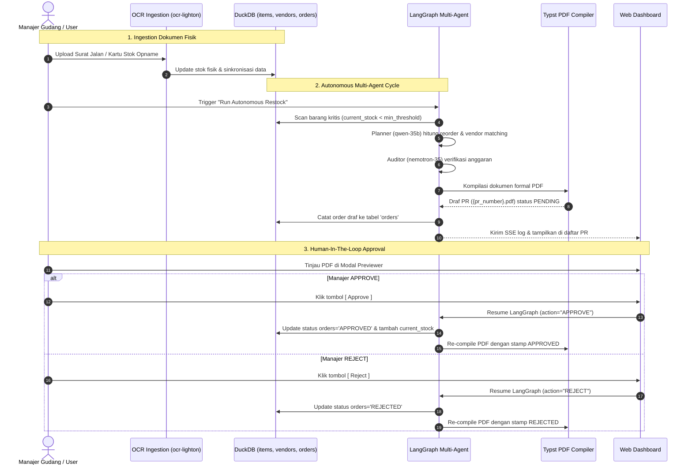

# 📦 AutoRestock-Agent
> **Autonomous Multi-Agent Inventory Replenishment & Procurement System**  
> Powered by **LangGraph**, `qwen-35b`, `nemotron-35`, `ocr-lighton`, **Typst**, and **DuckDB**.

---

## 🌟 Fitur & Keunggulan Utama
- **Document-to-Database OCR Ingestion (`ocr-lighton`)**: Ekstraksi otomatis fisik Surat Jalan (Delivery Notes), Kartu Stok Opname Gudang, dan Faktur Pembelian langsung tersinkronisasi ke tabel database DuckDB.
- **Visual Warehouse Shelf Audit (`qwen-35b-vision`)**: Deteksi visual slot rak gudang yang kosong (*depleted/critical empty*) dengan bounding box annotation.
- **Dynamic Safety Stock Algorithm**:
  $$\text{Safety Stock} = \text{Lead Time} \times \text{Daily Usage} \times 1.5$$
  $$\text{Reorder Qty} = (\text{Daily Usage} \times \text{Lead Time}) + \text{Safety Stock} - \text{Current Stock}$$
- **Multi-Agent Orchestration (LangGraph)**:
  - **Scan Node**: Memindai inventaris kritis (`current_stock < min_threshold`) di DuckDB.
  - **Planner Agent (`qwen-35b`)**: Mencocokkan vendor terbaik berdasarkan harga terendah, lead time, dan rating.
  - **Compliance Auditor (`nemotron-35`)**: Evaluasi kepatuhan anggaran dan batas pagu pengadaan.
  - **Typst Document Node**: Kompilasi draf Purchase Requisition (PR) PDF formal dalam hitungan milidetik (<50ms).
  - **Wait Approval Node (Human-In-The-Loop)**: Alur persetujuan manajerial (*APPROVE* / *REJECT*) yang memperbarui database `orders` & `items`.
- **Modern Web Dashboard**: Pemantauan inventaris real-time, drag-and-drop OCR dropzone, Live Server-Sent Events (SSE) Agent Console, dan in-browser PDF modal previewer.

---

## 🔄 Alur Kerja Project (Workflow)



---

## 📁 Struktur Direktori

```text
AutoRestock-Agent/
├── agents/                  # LangGraph multi-agent core & state schemas
│   ├── state.py             # Shared state & models (RestockItem, PurchaseRequisition)
│   └── workflow.py          # StateGraph (Scan -> Planner -> Auditor -> Typst -> HITL)
├── api/                     # FastAPI backend application
│   ├── main.py              # App entrypoint, middleware, & static mounts
│   └── routers/             # Endpoint routers (agent, approval, ingest, stream)
├── bot/                     # Telegram interactive approval bot
├── core/                    # Konfigurasi, schema kontrak, LLM client gateway
├── database/                # DuckDB connection, schema initialization, & seed data
├── docgen/                  # Typst typesetting template & compiler engine
│   └── templates/           # purchase_requisition.typ
├── multimodal/              # OCR engine (LightOn) & Vision shelf auditor
├── scripts/                 # Demo scripts & sample asset generators
├── storage/                 # Storage runtime PDF documents & images
├── tests/                   # Test suites (run_tests.py, test_api_and_pipeline.py)
├── web/                     # Web dashboard frontend (HTML, CSS, JS)
├── requirements.txt         # Python dependencies
└── seed_demo.py             # Interactive CLI simulation script
```

---

## 🚀 Panduan Menjalankan Project (Tanpa Docker)

### 1. Persiapan Environment Python
Pastikan Python 3.10+ telah terpasang di laptop Anda.

```bash
# Masuk ke direktori project
cd d:\Code\AutoRestock-Agent

# Install dependensi (cukup sekali)
pip install -r requirements.txt
```

### 2. Inisialisasi Database & Seeding Data
Jalankan perintah ini untuk membuat database DuckDB (`storage/inventory.db`) dan mengisi 25 data inventaris realistis:

```bash
python database/seed_data.py
```

### 3. Menjalankan Web Dashboard & API Server
Jalankan dev server FastAPI menggunakan Uvicorn:

```bash
python -m uvicorn api.main:app --host 127.0.0.1 --port 8000 --reload
```

Buka browser Anda di:
- 🌐 **Web Dashboard UI**: [http://127.0.0.1:8000](http://127.0.0.1:8000)
- 📑 **Interactive API Docs (Swagger)**: [http://127.0.0.1:8000/docs](http://127.0.0.1:8000/docs)

---

## 🧪 Menjalankan Pengujian & Simulasi

### Opsi A: Simulasi Interaktif CLI
Untuk melihat seluruh proses multi-agent dan mengambil keputusan *APPROVE/REJECT* langsung di terminal:
```bash
python seed_demo.py
```

### Opsi B: Menjalankan Unit & Integration Tests
Untuk menjalankan seluruh 11 unit test dan 8 integration test:
```bash
# Menjalankan seluruh test suite
python -m unittest discover -s tests -p "test_*.py"

# Atau menjalankan end-to-end API pipeline test
python tests/test_api_and_pipeline.py
```

