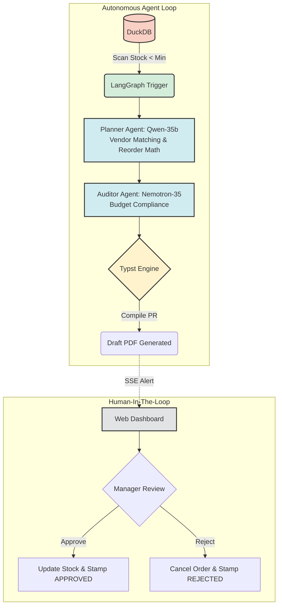

<div align="center">
  <h1>📦 AutoRestock-Agent</h1>
  <p><strong>Autonomous Multi-Agent Inventory Replenishment & Procurement System</strong></p>
  <p>
    
    
    
    
    
  </p>
</div>

---

## 📝 Description

**AutoRestock-Agent** is an intelligent, autonomous inventory management and procurement system. Built on a multi-agent architecture using **LangGraph**, it continuously monitors inventory levels (via **DuckDB**) and triggers automated workflows when stock falls below a safety threshold. The system intelligently matches vendors, audits budgets, and compiles formal Purchase Requisition (PR) documents dynamically using **Typst**. The final decision is delegated to a Human-in-the-Loop (HITL) approval process via a modern web dashboard.

### 🏷️ Topics
`Artificial Intelligence`, `LangGraph`, `Multi-Agent Systems`, `FastAPI`, `DuckDB`, `Inventory Management`, `Procurement`, `Typst`, `Python`, `Automated Workflow`

---

## ✨ Features & Capabilities

| Feature | Description | Technology Stack |
| :--- | :--- | :--- |
| **🤖 Multi-Agent AI Orchestration** | Autonomous agents (Planner, Auditor) that calculate reorder quantities and verify budgets. | LangGraph, Qwen-35b, Nemotron-35 |
| **📊 Dynamic Safety Stock Algorithm** | Calculates optimal restock quantities based on lead time and daily usage dynamically. | Python / DuckDB |
| **📄 Blazing-Fast PDF Generation** | Compiles formal Purchase Requisition drafts in under 50ms using modern typesetting. | Typst |
| **👥 Human-in-the-Loop (HITL)** | Intercepts agent workflows to await managerial approval (Approve/Reject) on the generated PR. | FastAPI, SSE, Web Dashboard |
| **🌐 Modern Web Dashboard** | A responsive UI for real-time inventory monitoring and PR document previews. | HTML5, CSS3, JavaScript |

---

## 🔄 System Architecture & Workflow

The following flowchart illustrates the autonomous procurement lifecycle, from detecting critical stock levels to the final human approval.



---

## 🧮 Safety Stock Algorithm

The system employs a robust mathematical model to determine optimal restock volumes:

$$ \text{Safety Stock} = \text{Lead Time} \times \text{Daily Usage} \times 1.5 $$
$$ \text{Reorder Qty} = (\text{Daily Usage} \times \text{Lead Time}) + \text{Safety Stock} - \text{Current Stock} $$

---

## 🚀 Getting Started

### Prerequisites
- Python 3.10 or higher
- Git

### Installation

1. **Clone the repository:**
   ```bash
   git clone https://github.com/daffaarigoh/AutoRestock-Agent.git
   cd AutoRestock-Agent
   ```

2. **Set up the virtual environment:**
   ```bash
   python -m venv .venv
   source .venv/bin/activate  # On Windows use: .venv\Scripts\activate
   ```

3. **Install dependencies:**
   ```bash
   pip install -r requirements.txt
   ```

4. **Initialize Database & Seed Data:**
   Creates a DuckDB instance (`storage/inventory.db`) with 25 realistic mock products.
   ```bash
   python database/seed_data.py
   ```

### Running the Application

Start the FastAPI application server:

```bash
python -m uvicorn api.main:app --host 127.0.0.1 --port 8050 --reload
```

- **Web Dashboard UI**: [http://127.0.0.1:8050](http://127.0.0.1:8050)
- **API Documentation**: [http://127.0.0.1:8050/docs](http://127.0.0.1:8050/docs)

---

## 🧪 Testing & Simulation

The project includes both an interactive CLI simulator and a comprehensive test suite.

### Interactive CLI Simulation
Run a complete multi-agent cycle directly in your terminal to see how the Planner and Auditor nodes interact before Human approval.
```bash
python seed_demo.py
```

### Running Unit & Integration Tests
Ensure system integrity by running the test suite:
```bash
# Run all tests
python -m unittest discover -s tests -p "test_*.py"

# Run end-to-end API pipeline integration test
python tests/test_api_and_pipeline.py
```

---

## 📁 Repository Structure

```text
AutoRestock-Agent/
├── agents/                  # LangGraph multi-agent logic (Planner, Auditor, HITL)
├── api/                     # FastAPI backend application & routers
├── core/                    # System configurations & LLM integrations
├── database/                # DuckDB schema and seeding logic
├── docgen/                  # Typst templates & rendering engine
├── storage/                 # Local storage for DuckDB and Generated PDFs
├── tests/                   # Unit & E2E Integration tests
└── web/                     # Frontend Dashboard (HTML, CSS, JS)
```
