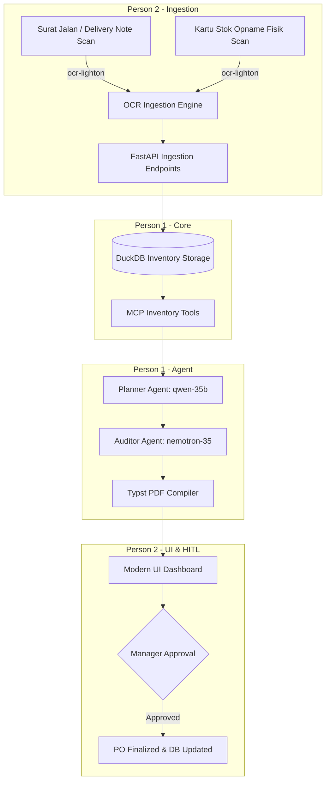

# 📦 AutoRestock-Agent
> **Autonomous Multi-Agent Procurement & Inventory Restock System**  
> Powered by `qwen-35b`, `nemotron-35`, `ocr-lighton`, **Typst**, and **DuckDB**.

---

## 🌟 Key Highlights
- **Document-to-Database Ingestion (`ocr-lighton`)**: Scans physical Surat Jalan (delivery notes), physical stock opname count cards, and supplier invoices directly into structured records.
- **Dynamic Safety Stock Engine**: Reorder quantities calculated dynamically based on supplier lead times and historical burn rate.
- **Multi-Agent Orchestration (LangGraph)**:
  - **Planner Agent (`qwen-35b`)**: Identifies reorders and performs optimal multi-vendor matching.
  - **Compliance Auditor (`nemotron-35`)**: Evaluates budget sanity and regulatory compliance before document synthesis.
- **Ultra-Fast Typesetting with Typst**: Compiles formal, pixel-perfect Purchase Requisition PDF documents in milliseconds (<50ms).
- **Human-In-The-Loop (HITL)**: Manager approval workflow via interactive web dashboard & webhook notifications.

---

## 🏗️ System Architecture



---

## 👥 Team Responsibilities
- **Person 1 (Backend, Data & Agent Lead)**: `database/`, `agents/`, `docgen/` (Typst), `mcp_server/`.  
  *(See [`TASK_PERSON_1_BACKEND.md`](TASK_PERSON_1_BACKEND.md) for full instructions).*
- **Person 2 (Document Ingestion, Frontend, HITL & DevOps Lead)**: `multimodal/` (OCR Engine), `core/`, `api/routers/ingest_routes.py`, `web/`, Docker, and CI/CD.

---

## 🚀 Quickstart Guide

### 1. Installation
```bash
git clone https://github.com/YourOrg/AutoRestock-Agent.git
cd AutoRestock-Agent

# Install dependencies
pip install -r requirements.txt
```

### 2. Generate Sample Assets & Run Tests
```bash
# Generate synthetic delivery note and stock opname sample cards
python scripts/generate_sample_assets.py

# Run unit tests
python tests/run_tests.py
```

### 3. Start the API Server
```bash
python -m uvicorn api.main:app --host 0.0.0.0 --port 8000 --reload
```
Access the interactive Swagger documentation at: **`http://localhost:8000/docs`**

---

## 🐳 Docker Deployment
```bash
docker-compose up --build -d
```
