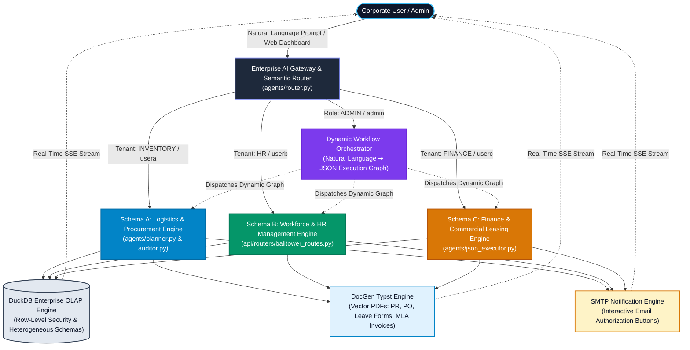
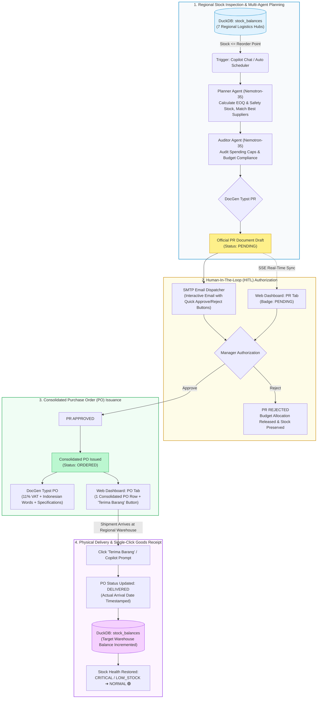
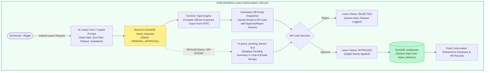
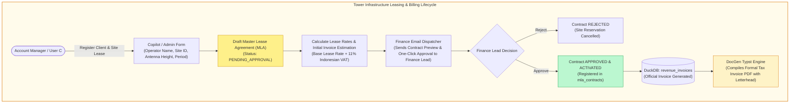

<div align="center">
  <h1>🏢 PT BALI TOWERINDO SENTRA TBK</h1>
  <h3>📦 AutoRestock-Agent — Autonomous Multi-Agent Procurement & Enterprise Intelligence Platform</h3>
  <p>
    
    
    
    
    
    
  </p>
</div>

---

## 📝 Executive Overview

**AutoRestock-Agent** is an enterprise-grade autonomous multi-agent operating system engineered for **PT Bali Towerindo Sentra Tbk** (IDX: `BALI`). Built upon **FastAPI**, **LangGraph**, **DuckDB**, and **Typst Engine**, the platform automates and orchestrates mission-critical operations across three core corporate divisions and enterprise administration:

1. **📦 Schema A — Inventory & Logistics Hubs (`usera`)**:
   Autonomous regional stock monitoring across 7 logistics hubs, algorithmic reorder calculations (*Reorder Point & Safety Stock*), multi-agent Purchase Requisition (PR) compilation, single-consolidated Purchase Order (PO) issuance, and single-click regional Goods Receipt.
2. **👥 Schema B — Human Resources & Field Operations (`userb`)**:
   Field technician/rigger leave request lifecycle, automated corporate PDF generation, pending leave audit workflows (`WF-847DA5`), interactive manager email authorization, and real-time annual leave quota balance mutation.
3. **💼 Schema C — Finance & Commercial Leasing (`userc`)**:
   Master Lease Agreement (MLA) contract onboarding for telecom operators (Telkomsel, Indosat Ooredoo Hutchison, XL Axiata, Smartfren), contractual billing schedules, financial authorization, and automated revenue invoice PDF compilation with 11% Indonesian VAT (*PPN*).
4. **👑 Enterprise Administration & Workflow Orchestration (`admin`)**:
   Natural language-to-JSON dynamic workflow compilation, cross-tenant database governance, real-time audit tracing, and system health monitoring.

---

## 🌐 Master Enterprise Architecture (Macro View)

The following master diagram illustrates how natural language prompts and web interactions flow through the central AI Gateway and Semantic Router, routing dynamically to the appropriate corporate division engine while sharing core OLAP storage, typesetting, and notification services:



---

## 🔄 Detailed Division Workflows (Micro Level)

### 📦 Pipeline A: Autonomous Inventory Replenishment & Goods Receipt (`usera`)

This workflow governs physical logistics across 7 regional hubs (`WH-JKT-01`, `WH-BDG-01`, `WH-SBY-01`, `WH-SMG-01`, `WH-MDN-01`, `WH-MKS-01`, `WH-DPS-01`).



---

### 👥 Pipeline B: Field Workforce Leave Management & Quota Deduction (`userb`)

This workflow governs field technicians and tower riggers, ensuring leave requests undergo managerial verification before annual balances are deducted.



---

### 💼 Pipeline C: Telecom Operator Onboarding & Tower Lease Invoicing (`userc`)

This workflow governs commercial leasing for telecommunication operators (Telkomsel, Indosat Ooredoo Hutchison, XL Axiata, Smartfren) utilizing PT Bali Towerindo Sentra Tbk infrastructure.



---

### 👑 Admin Pipeline: Natural Language Dynamic Workflow Orchestrator (`admin`)

Administrators can design, update, and deploy automated multi-step workflows using plain natural language without writing code.

```mermaid
flowchart LR
    Admin([Enterprise Admin]) -->|Writes Natural Language Instruction| LLM["LLM Graph Compiler<br/>(Gemini / Nemotron-35)"]
    LLM -->|Compiles to Structured JSON| Graph["Execution Graph JSON<br/>(Tool Steps, Tasks, Conditions)"]
    Graph -->|Stored in DuckDB| DB[("workflows Table")]
    DB -->|Triggered by User Intent| Engine["JSONExecutionEngine<br/>(agents/json_executor.py)"]
    Engine -->|Dynamic Sequential Execution| Tools["Tool Registry<br/>(Inventory, HR, Finance, DocGen, Dispatch)"]
    Tools -->|Real-time SSE Stream| Dashboard["Live Corporate Dashboard"]

    style LLM fill:#e0e7ff,stroke:#6366f1,stroke-width:1.5px
    style Graph fill:#fef3c7,stroke:#d97706,stroke-width:1.5px
    style Engine fill:#dcfce7,stroke:#16a34a,stroke-width:1.5px
```



---

## 🏛️ Multi-Tenant RBAC & Domain Governance Matrix

| Persona | Role | Division / Tenant | Database Scope | Key Operational Capabilities |
| :--- | :---: | :---: | :--- | :--- |
| **`usera`** | `USER` | `INVENTORY` (Tenant A) | `stock_balances`, `inventory_items`, `purchase_orders`, `purchase_requests`, `warehouses` | • Audit stock across 7 regional hubs<br/>• Generate PRs for low/critical items<br/>• One-click Goods Receipt (`[✓ Terima Barang]`)<br/>• Register new material SKUs |
| **`userb`** | `USER` | `HR` (Tenant B) | `employees`, `leave_requests` | • Submit rigger/technician leave requests<br/>• Execute pending leave audit (`WF-847DA5`)<br/>• Trigger HR authorization emails<br/>• Deduct approved days from annual quota |
| **`userc`** | `USER` | `FINANCE` (Tenant C) | `telecom_clients`, `mla_contracts`, `revenue_invoices`, `power_utility_expenses` | • Register telecom clients (Telkomsel, XL, IOH)<br/>• Draft tower lease contracts (MLA)<br/>• Dispatch finance authorization emails<br/>• Generate official billing invoices (11% VAT) |
| **`admin`** | `ADMIN` | `ALL` (Super Admin) | Unrestricted access across all master and tenant tables | • Natural Language Workflow Orchestrator<br/>• Cross-division AI Copilot governance<br/>• Database schema migrations & seeding<br/>• System audit logs & security monitoring |

---

## 💻 Technology Stack

| Architectural Layer | Technology Stack | Technical Specifications & Role |
| :--- | :--- | :--- |
| **Core API & Gateway** | **Python 3.10+**, **FastAPI**, **Pydantic v2** | High-performance asynchronous REST API, JWT authentication, and dependency-injected RBAC security. |
| **Multi-Agent Orchestrator** | **LangGraph**, **NVIDIA Nemotron-35**, **Gemini 2.5** | Multi-agent state machine coordinating mathematical planners, compliance auditors, and semantic routers. |
| **Analytical OLAP Engine** | **DuckDB Embedded** | High-speed in-process columnar SQL database with automatic transactional CSV persistence. |
| **Document Typesetting** | **Typst Compiler (Python Typst 0.11+)** | High-fidelity vector PDF typesetting engine (<50ms compilation) supporting multi-page layouts and corporate typography. |
| **Notification Engine** | **Python smtplib** / **aiosmtplib** | Corporate HTML email dispatcher with cryptographic action URLs for one-click manager authorization. |
| **User Interface** | **Semantic HTML5**, **Vanilla CSS**, **JavaScript**, **SSE** | Responsive dark/light corporate operations dashboard with zero external CSS framework bloat and live event streaming. |

---

## 🚀 Getting Started & Operational Guide

### 1. Prerequisites
- Python 3.10 or higher
- Git
- Local workstation (Windows, macOS) or Linux Server (Ubuntu 22.04+)

### 2. Installation
```bash
# 1. Clone the repository
git clone https://github.com/daffaarigoh/AutoRestock-Agent.git
cd AutoRestock-Agent

# 2. Set up virtual environment
python -m venv .venv
# On Linux / macOS:
source .venv/bin/activate
# On Windows (PowerShell):
.venv\Scripts\Activate.ps1

# 3. Install dependencies
pip install -r requirements.txt
```

### 3. Database Initialization & Seeding
Initialize the DuckDB master tables and seed realistic operational data for PT Bali Towerindo Sentra Tbk:
```bash
python database/seed_data.py
```

### 4. Running the Application Server
Start the FastAPI server on port `8050`:
```bash
python -m uvicorn api.main:app --host 0.0.0.0 --port 8050 --reload
```

- **Operations Dashboard**: [http://localhost:8050](http://localhost:8050)
- **Interactive Swagger Docs**: [http://localhost:8050/docs](http://localhost:8050/docs)
- **Admin Workflow Studio**: [http://localhost:8050/admin](http://localhost:8050/admin)

### 5. Default Corporate Credentials
| Username | Password | Role | Division / Access Scope |
| :--- | :--- | :--- | :--- |
| `admin` | `admin123` | `ADMIN` | Super Admin (Cross-Tenant Access & Workflow Orchestrator) |
| `usera` | `user123` | `USER` | Logistics & Inventory Hubs (Schema A) |
| `userb` | `user123` | `USER` | Human Resources & Field Operations (Schema B) |
| `userc` | `user123` | `USER` | Finance & Commercial Leasing (Schema C) |

---

## 🧪 Automated Testing Suite

The repository includes a comprehensive test suite validating all multi-agent workflows, PDF document compilers, and API endpoints:

```bash
# Run all unit and integration tests
python -m unittest discover -s tests -p "test_*.py"

# Run Typst Purchase Order (PO) compiler tests
python tests/test_po_pdf_generation.py

# Run end-to-end API pipeline integration test
python tests/test_api_and_pipeline.py
```

---

## 📂 Repository Directory Structure

```text
AutoRestock-Agent/
├── agents/                  # Multi-agent LangGraph logic (Planner, Auditor, Router, JSON Executor)
├── api/                     # FastAPI endpoint routers (Balitower, Approvals, Agents, Auth, Documents)
├── core/                    # System configuration, environment loader, Pydantic schemas, JWT security
├── data/                    # Persistent Bali Tower CSV datasets (Inventory, HR, Finance)
├── database/                # DuckDB initialization, master schemas, migration & seeding scripts
├── docgen/                  # Typst compilation engine & official corporate document templates
│   └── templates/           # Typst source templates (purchase_requisition, purchase_order, leave, invoice)
├── storage/                 # Generated PDF documents, local database files, and file archives
├── tests/                   # Automated unit, integration, and E2E test suite
└── web/                     # Frontend dashboard web assets
    ├── static/              # Visual assets, dashboard JavaScript modules, and CSS design system
    │   ├── css/             # Dashboard and admin stylesheets
    │   └── js/              # Client-side state managers, chat controller, and table renderers
    └── templates/           # Jinja2 / HTML index page templates
```

---

<div align="center">
  <p><strong>PT Bali Towerindo Sentra Tbk</strong> &bull; Telecommunication Infrastructure & Fiber Optic Solutions</p>
  <p><em>Wisma Kodel Lantai 6, Jl. H.R. Rasuna Said Kav. B-4, Setiabudi, Jakarta Selatan 12920, Indonesia</em></p>
</div>
