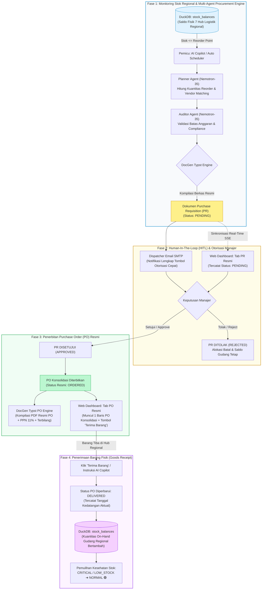

<div align="center">
  <h1>🏢 PT BALI TOWERINDO SENTRA TBK</h1>
  <h3>📦 AutoRestock-Agent — Autonomous Multi-Agent Procurement & Operational Intelligence</h3>
  <p>
    
    
    
    
    
    
  </p>
</div>

---

## 📝 Overview

**AutoRestock-Agent** adalah platform sistem cerdas multi-agen terintegrasi berbasis **FastAPI**, **LangGraph**, **DuckDB**, dan **Typst Engine** yang dirancang untuk mengotomatisasi siklus pengadaan material infrastruktur menara telekomunikasi (*Tower*) dan serat optik (*Fiber Optic*) PT Bali Towerindo Sentra Tbk secara otonom, akuntabel, dan *end-to-end*.

Sistem ini memantau saldo inventaris di 7 hub logistik regional secara *real-time*, mengidentifikasi barang kritis berdasarkan *Reorder Point (ROP)*, menghitung kuantitas pemesanan ekonomis (*Economic Order Quantity / Safety Stock*), mencocokkan vendor rekanan terbaik, menyusun dokumen resmi **Purchase Requisition (PR)** dan **Purchase Order (PO)**, mengirimkan notifikasi otorisasi interaktif ke manajer via email SMTP, hingga mencatat penerimaan barang fisik (**Goods Receipt**) langsung ke saldo gudang regional.

---

## 🔄 End-to-End System Architecture & Workflow

Diagram alir berikut menggambarkan keseluruhan siklus hidup pengadaan material dan tata kelola operasional perusahaan:



---

## ⚙️ Rincian 4 Fase Alur Pengadaan (*Procurement Lifecycle*)

### 1. Fase 1: Monitoring Stok & Multi-Agent Procurement Engine
- **Granularitas Data Gudang**: Sistem melacak saldo fisik di 7 Logistics Hub regional (`WH-JKT-01`, `WH-BDG-01`, `WH-SBY-01`, `WH-SMG-01`, `WH-MDN-01`, `WH-MKS-01`, `WH-DPS-01`).
- **Pendeteksian Dini**: Saat `quantity_on_hand <= reorder_point`, pemicu otomatis atau pengguna via AI Copilot memulai proses restock.
- **Konsolidasi Kebutuhan SKU**: Jika beberapa gudang regional membutuhkan material yang sama, sistem menggabungkan total kuantitas per SKU material unik ke dalam 1 baris PR agar pesanan ke rekanan vendor tidak berulang.
- **Auditor & Typst DocGen**: Agen mengaudit batasan plafon anggaran belanja dan menerbitkan draf resmi berkas PR format PDF Typst berstatus **`PENDING`**.

### 2. Fase 2: Human-In-The-Loop (HITL) Otorisasi Manajer
- **Pemisahan Siklus Hidup**: Saat PR berstatus `PENDING`, pesanan pembelian (**PO**) **TIDAK** langsung diterbitkan ke vendor ataupun dimunculkan di tab PO dengan tombol terima barang.
- **Notifikasi Email Interaktif**: Email otomatis terkirim ke manajer pengadaan melalui SMTP/dispatcher, berisikan rekapitulasi kebutuhan material, lampiran PDF PR, serta tombol aksi cepat *Approve* atau *Reject*.
- **Web Dashboard Sync**: Antarmuka dashboard secara *real-time* menampilkan dokumen PR pada tab *Dokumen Purchase Requisition Resmi* berlabel kuning **`PENDING`**.

### 3. Fase 3: Penerbitan Purchase Order (PO) Konsolidasi
- **Pemicu Persetujuan**: Manajer menekan tombol *Approve* (melalui email atau antarmuka sistem).
- **1 PO Konsolidasi per Dokumen PR**: Seluruh material di bawah PR yang disetujui disatukan ke dalam **1 nomor PO resmi** (contoh: `PO-2026-038` / `PO/BLT/2026/03/036`) berstatus **`ORDERED`**.
- **Alokasi Cerdas Gudang Kritis**: Alokasi penerimaan PO otomatis diarahkan ke gudang regional yang stoknya berstatus `CRITICAL` atau `LOW_STOCK` (misal: material kabel FO otomatis diarahkan ke Hub Bandung `WH-BDG-01`).
- **Kompilasi PO PDF Resmi**: Dokumen PO dikompilasi ke format PDF Typst lengkap dengan perhitungan PPN 11%, subtotal, total akhir, kalimat terbilang bahasa Indonesia (*Rupiah*), dan klausul syarat pengadaan resmi PT Bali Towerindo Sentra Tbk.

### 4. Fase 4: Penerimaan Barang Fisik (*Goods Receipt*) Sekali Klik
- **Verifikasi Kedatangan**: Ketika kiriman fisik tiba di gudang tujuan, staf gudang cukup menekan **1 tombol `[✓ Terima Barang]`** pada baris PO di dashboard, atau mengirim instruksi ke Copilot: *"Barang untuk PO-2026-038 sudah sampai di gudang"*.
- **Multi-Item Receipt Serentak**: Seluruh material di dalam PO tersebut diproses sekaligus:
  1. Status PO berubah menjadi **`DELIVERED`** dengan stempel tanggal kedatangan aktual.
  2. Kuantitas saldo fisik pada tabel `stock_balances` di gudang regional terkait bertambah (`quantity_on_hand += order_quantity`).
  3. Status kesehatan stok dikalkulasi ulang dan pulih menjadi **`NORMAL`**.
  4. Mencegah penambahan ganda (*Idempotent Protection*) demi integritas data inventaris.

---

## 🏛️ Arsitektur Multi-Tenant & Domain Bisnis Korporat

Sistem menerapkan isolasi data berbasis *Role-Based Access Control (RBAC)* dan skema multi-divisi korporat:

| Skema / Persona | Divisi Korporat | Tanggung Jawab & Fitur Utama |
| :--- | :--- | :--- |
| **Schema A** (`usera`) | **Logistik & Inventaris** | Monitoring saldo stok menara & FO 7 regional, reorder calculation, approval PR, penerimaan PO (*Goods Receipt*), registrasi SKU material baru. |
| **Schema B** (`userb`) | **Human Resources & GA** | Pengajuan cuti teknisi lapangan/rigger, audit permohonan cuti pending (`WF-847DA5`), otorisasi email HR, pemotongan otomatis kuota cuti tahunan karyawan. |
| **Schema C** (`userc`) | **Finance & Komersial** | Pendaftaran klien operator telekomunikasi (Telkomsel, Indosat Ooredoo Hutchison, XL Axiata, Smartfren), penyusunan draf kontrak sewa menara (*MLA*), penerbitan tagihan invoice pendapatan berkop surat Typst. |
| **Super Admin** (`admin`) | **Enterprise Admin** | Akses bebas lintas tenant, orkestrasi alur kerja kustom (*Custom Workflow Orchestrator*), integrasi database master DuckDB, audit log sistem. |

---

## 💻 Tech Stack

| Komponen | Teknologi | Keterangan |
| :--- | :--- | :--- |
| **Core Backend** | Python 3.10+, FastAPI, Pydantic v2 | High-performance asynchronous API & REST routing |
| **AI Multi-Agent** | LangGraph, NVIDIA Nemotron-35, Ollama / Gemini | Autonomous agent coordination, math planner, & budget auditor |
| **Database OLAP** | DuckDB Embedded | High-speed in-process analytical SQL engine & dual CSV persistence |
| **Document Engine** | Typst Compiler (Python Typst 0.11+) | Ultra-fast vector PDF typesetting with corporate typography |
| **Notification Engine**| Python smtplib / aiosmtplib | Interactive corporate HTML email dispatch with authorization buttons |
| **Frontend UI** | Semantic HTML5, Vanilla CSS, JavaScript, SSE | Modern dark/light corporate dashboard, zero external CSS bloat |

---

## 🚀 Panduan Menjalankan Sistem

### 1. Prasyarat Sistem
- Python 3.10 atau versi lebih baru
- Git
- Dukungan koneksi lokal atau server Linux (Ubuntu/Debian)

### 2. Instalasi Dependensi
```bash
# Clone repository
git clone https://github.com/daffaarigoh/AutoRestock-Agent.git
cd AutoRestock-Agent

# Buat & aktifkan virtual environment
python -m venv .venv
# Linux/macOS:
source .venv/bin/activate
# Windows:
.venv\Scripts\activate

# Instalasi packages
pip install -r requirements.txt
```

### 3. Inisialisasi Database & Seeding
```bash
# Menyiapkan tabel DuckDB master dan data logistik Bali Tower
python database/seed_data.py
```

### 4. Menjalankan Server Backend & Dashboard
```bash
# Menjalankan aplikasi FastAPI pada port 8050
python -m uvicorn api.main:app --host 0.0.0.0 --port 8050 --reload
```

- **Akses Dashboard Web**: [http://localhost:8050](http://localhost:8050)
- **Dokumentasi API Swagger**: [http://localhost:8050/docs](http://localhost:8050/docs)
- **Akun Bawaan Sistem**:
  - `admin` / `admin123` (Super Admin)
  - `usera` / `user123` (Divisi Inventaris & Gudang)
  - `userb` / `user123` (Divisi HR & GA)
  - `userc` / `user123` (Divisi Finance & Komersial)

---

## 🧪 Verifikasi & Pengujian Otomatis

Sistem dilengkapi dengan test suite lengkap untuk memvalidasi alur pengadaan:

```bash
# Menjalankan seluruh pengujian unit dan integrasi
python -m unittest discover -s tests -p "test_*.py"

# Pengujian khusus kompilasi Typst PDF Purchase Order (PO)
python tests/test_po_pdf_generation.py

# Pengujian integrasi pipeline pengadaan end-to-end
python tests/test_api_and_pipeline.py
```

---

## 📂 Struktur Repositori

```text
AutoRestock-Agent/
├── agents/                  # Multi-agent LangGraph (Planner, Auditor, Router, JSON Executor)
├── api/                     # Endpoint FastAPI (Balitower, Approvals, Agents, Auth, Documents)
├── core/                    # Konfigurasi aplikasi, env loader, schema Pydantic, security JWT
├── data/                    # Berkas sumber data persisten CSV Bali Tower (Inventory, HR, Finance)
├── database/                # Inisialisasi DuckDB, skema tabel master, script migrasi & seeding
├── docgen/                  # Mesin kompilasi PDF Typst & template resmi (PR, PO, Cuti, Invoice)
│   └── templates/           # Template berkas dokumen Typst (.typ)
├── storage/                 # Arsip digital dokumen terbitan (PR, PO, BAST, Invoices) & DB lokal
├── tests/                   # Test suite otomatis (Unit test, integration test, E2E flow)
└── web/                     # Web Dashboard statis frontend (HTML, Vanilla CSS, JavaScript)
    ├── static/              # Asset visual, modul JavaScript, dan CSS dashboard
    └── templates/           # Berkas template halaman index dashboard
```

---

<div align="center">
  <p><strong>PT Bali Towerindo Sentra Tbk</strong> — Telecommunication Infrastructure & Fiber Optic Solutions</p>
  <p><em>Autonomous Multi-Agent Enterprise Operations Command Center</em></p>
</div>
